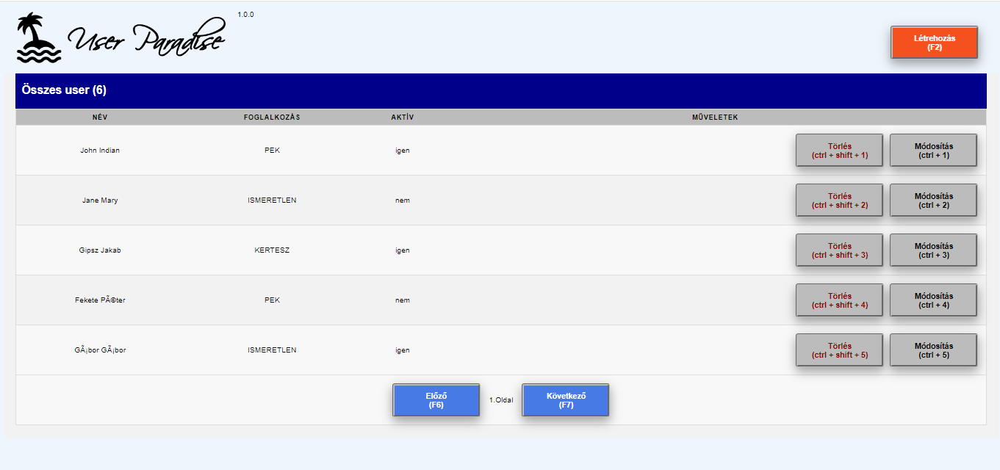

# user-paradise
mini springboot+angular CRUD app with h2db without any css framework

## how to build
to build the spring boot apps just run 
```mvn clean install```

compiled angular app is stored under ```user-ui/src/main/resources/static```

to build a new fresh runnable from the user-ng spa run
```mvn clean install -PbuildNg```

## how to start
to start backend on port 9010:
```cd user-business```
```mvn spring-boot:run```

to start frontend on port 9020:
```cd user-ui```
```mvn spring-boot:run```

to start frontend in dev mode on port 4200:
```cd user-ng```
```ng serve```

api documentation:
```user-api/doc/index.html```
or
[http://localhost:9010/swagger-ui/index.html](http://localhost:9010/swagger-ui/index.html)

h2 console:
[http://localhost:9010/h2-console](http://localhost:9010/h2-console)
sa/password

## how to open the ui
[http://localhost:9020](http://localhost:9020)
(or [http://localhost:4200](http://localhost:4200))



